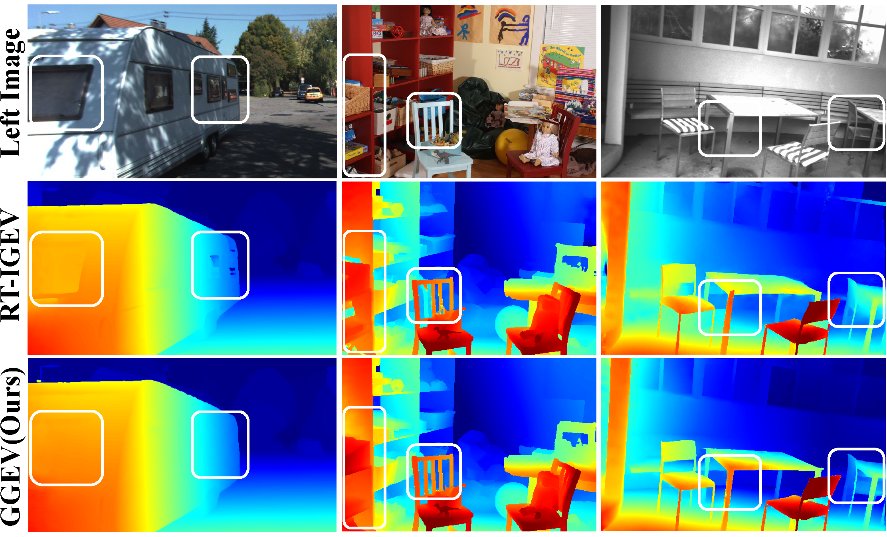
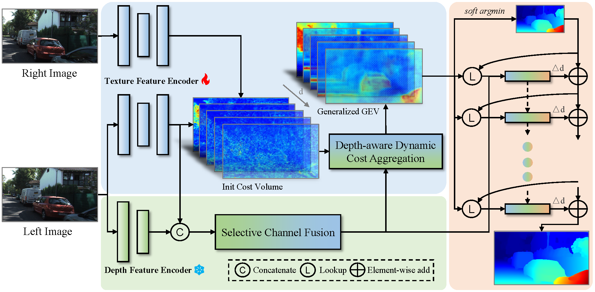
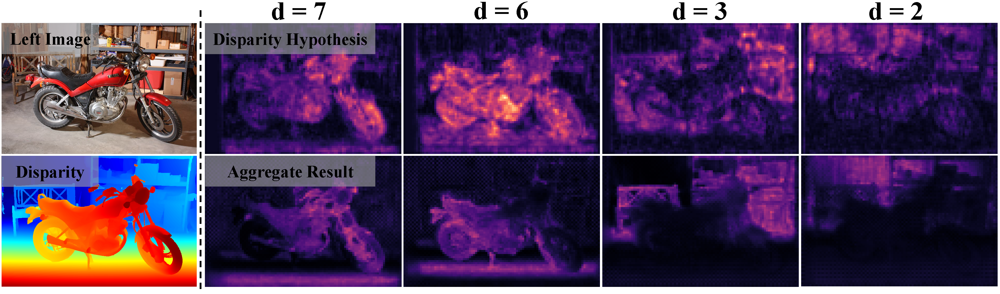

# GGEV
[Generalized Geometry Encoding Volume for Real-time Stereo Matching] <br/>
Jiaxin Liu, Gangwei Xu, Xianqi Wang, Chengliang Zhang, Xin Yang <br/>

## Zero-shot generalization comparison.

All models are trained on Scene Flow and tested on KITTI, Middlebury, and ETH3D. GGEV achieves comparable speed to RT-IGEV while offering improved generalization on unseen scenes.

## Network architecture

The Selective Channel Fusion (SCF) module integrates texture features with depth features as a guidance for cost aggregation. Then, the Depth-aware Dynamic Cost Aggregation (DDCA) module adaptively incorporates depth structural priors to enhance the fragile matching relationships in the initial cost volume, resulting in a generalized geometry encoding volume.

## 📢 News
2025-11-08: Our GGEV is accepted by AAAI.<br>

## Effectiveness of our DDCA in generalization evaluation.

The first row show the initial cost volume features across different disparity hypotheses, which are fragile in unseen scenes and contain many mismatches. In contrast, the second row shows the results after applying our DDCA, which effectively filters out incorrect matches and preserves accurate matching features at their corresponding disparity planes, leading to clearer and more reliable structures.

## Demos
Pretrained models can be downloaded from [google drive](https://drive.google.com/drive/folders/17zfezQdyF8NO75IYVUV8b5nCavFokqpv?usp=drive_link)

We assume the downloaded pretrained weights are located under the pretrained_models directory.

You can demo a trained model on pairs of images. To predict stereo for demo-imgs directory, run
```Shell
python demo_imgs.py --restore_ckpt ./pretrained_models/ggev/sceneflow.pth --left_imgs './demo-imgs/*/im0.png' --right_imgs './demo-imgs/*/im1.png'
```
You can switch to your own test data directory, or place your own pairs of test images in ./demo-imgs.

## Environment
* NVIDIA RTX 4090
* python 3.8

### Create a virtual environment and activate it.

```Shell
conda create -n GGEV python=3.8
conda activate GGEV
```
### Dependencies

```Shell
pip install torch==2.4.1 torchvision==0.19.1 torchaudio==2.4.1 --index-url https://download.pytorch.org/whl/cu118
pip install natten==0.17.1+torch240cu118 -f https://shi-labs.com/natten/wheels/
pip install tqdm scipy einops
pip install opencv-python==4.9.0.80
pip install scikit-image==0.21.0
pip install tensorboard==2.14.0
pip install matplotlib==3.7.4
pip install timm==0.5.4
pip install numpy==1.24.3
pip install -U xformers --index-url https://download.pytorch.org/whl/cu118
```
> To accelerate training and inference, we utilize the efficient large-kernel convolution proposed in [RepLKNet](https://github.com/DingXiaoH/RepLKNet-pytorch#use-our-efficient-large-kernel-convolution-with-pytorch). Please follow this [**guideline**](https://github.com/VITA-Group/SLaK#installation) to install the ``depthwise_conv2d_implicit_gemm`` function.


## Required Data

* [SceneFlow](https://lmb.informatik.uni-freiburg.de/resources/datasets/SceneFlowDatasets.en.html)
* [KITTI](https://www.cvlibs.net/datasets/kitti/eval_scene_flow.php?benchmark=stereo)
* [ETH3D](https://www.eth3d.net/datasets)
* [Middlebury](https://vision.middlebury.edu/stereo/submit3/)
* [TartanAir](https://github.com/castacks/tartanair_tools)
* [CREStereo Dataset](https://github.com/megvii-research/CREStereo)
* [FallingThings](https://research.nvidia.com/publication/2018-06_falling-things-synthetic-dataset-3d-object-detection-and-pose-estimation)
* [InStereo2K](https://github.com/YuhuaXu/StereoDataset)
* [Sintel Stereo](http://sintel.is.tue.mpg.de/stereo)
* [HR-VS](https://drive.google.com/file/d/1SgEIrH_IQTKJOToUwR1rx4-237sThUqX/view)


## Evaluation

To evaluate GGEV on Scene Flow or Middlebury, run

```Shell
python evaluate_stereo_rt.py --restore_ckpt ./pretrained_models/ggev/sceneflow.pth --dataset sceneflow
```
or
```Shell
python evaluate_stereo_rt.py --restore_ckpt ./pretrained_models/ggev/sceneflow.pth --dataset middlebury_Q
```

## Training

To train GGEV on Scene Flow or KITTI, run

```Shell
python train_stereo_rt.py --mixed_precision --precision_dtype bfloat16 --train_datasets sceneflow
```
or
```Shell
python train_stereo_rt.py --mixed_precision --precision_dtype bfloat16 --train_datasets kitti --restore_ckpt ./pretrained_models/ggev/sceneflow.pth
```

To train GGEV on ETH3D, you need to run
```Shell
python train_stereo_rt.py --train_datasets eth3d_train --restore_ckpt ./pretrained_models/ggev/sceneflow.pth --image_size 384 512 --num_steps 300000
python train_stereo_rt.py --tarin_datasets eth3d_finetune --restore_ckpt ./checkpoints/eth3d_train.pth --image_size 384 512 --num_steps 100000
```

## Submission

For GGEV submission to the KITTI benchmark, run
```Shell
python save_disp_rt.py
```

## Citation

If you find our works useful in your research, please consider citing our papers:

```bibtex
@misc{liu2025generalizedgeometryencodingvolume,
      title={Generalized Geometry Encoding Volume for Real-time Stereo Matching}, 
      author={Jiaxin Liu and Gangwei Xu and Xianqi Wang and Chengliang Zhang and Xin Yang},
      year={2025},
      eprint={2512.06793},
      archivePrefix={arXiv},
      primaryClass={cs.CV},
      url={https://arxiv.org/abs/2512.06793}, 
}
```


# Acknowledgements

This project is based on [IGEV-plusplus](https://github.com/gangweix/IGEV-plusplus), and [OverLoCK](https://github.com/LMMMEng/OverLoCK). We thank the original authors for their excellent works.

